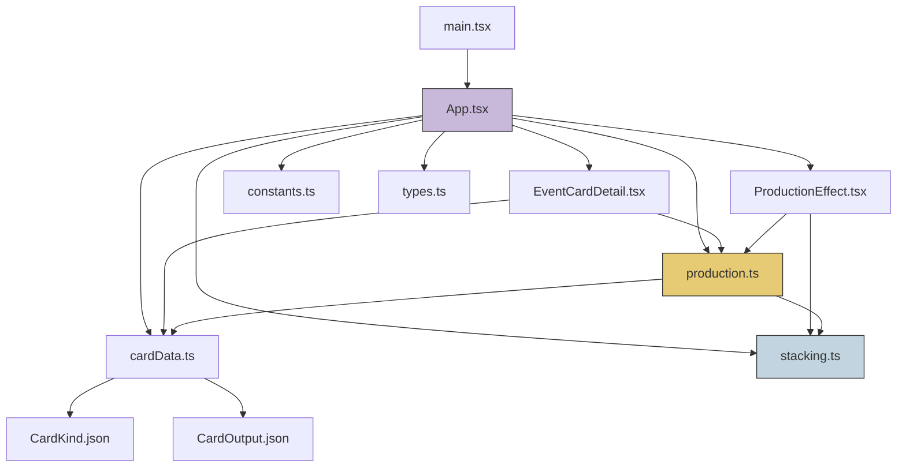
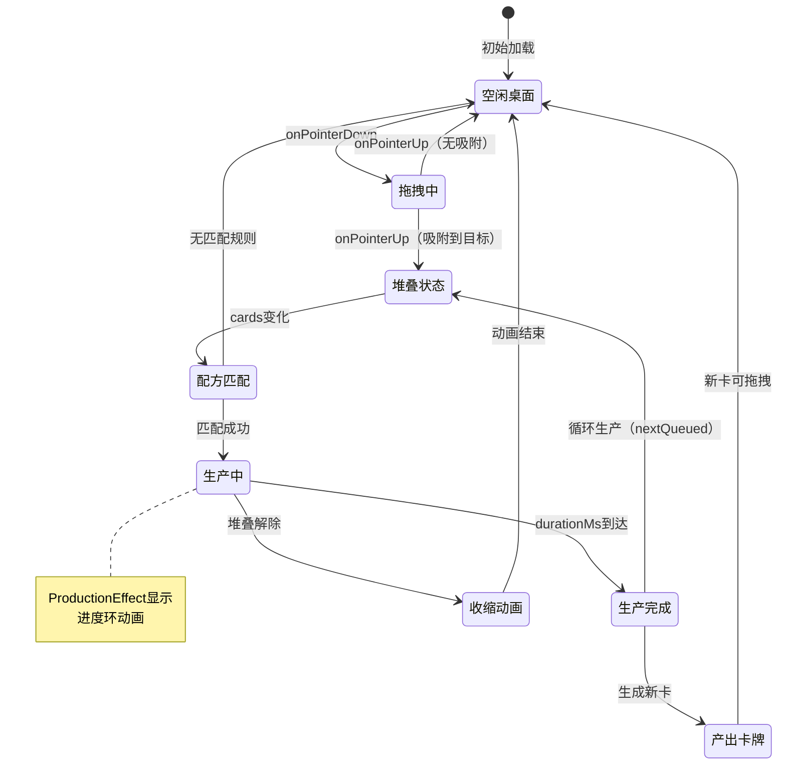
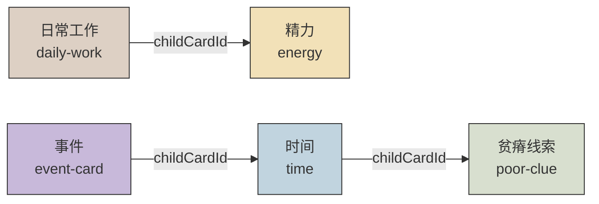
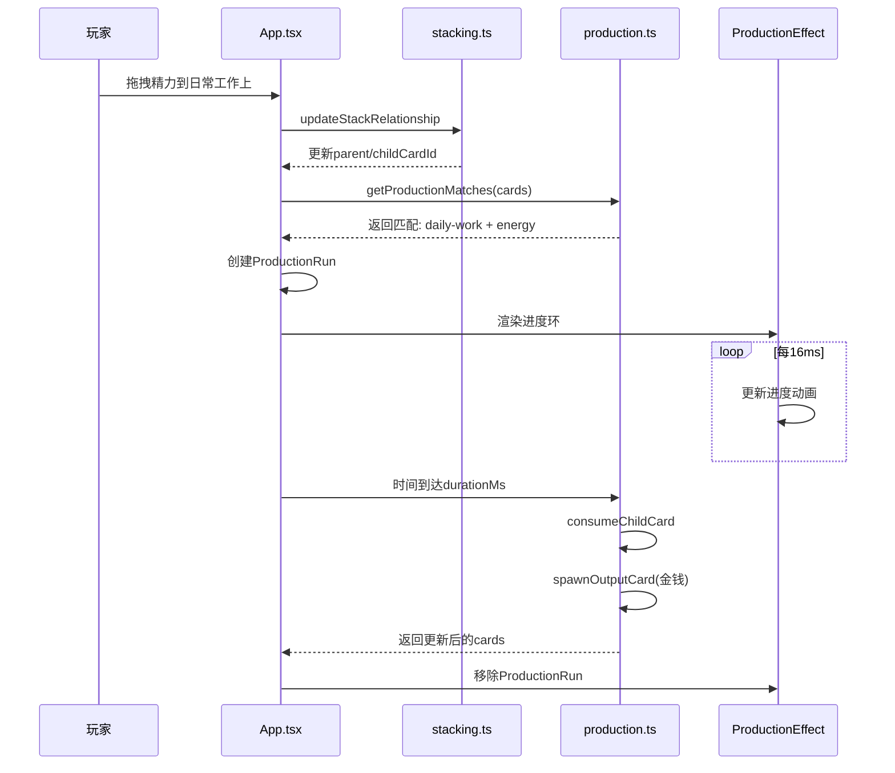
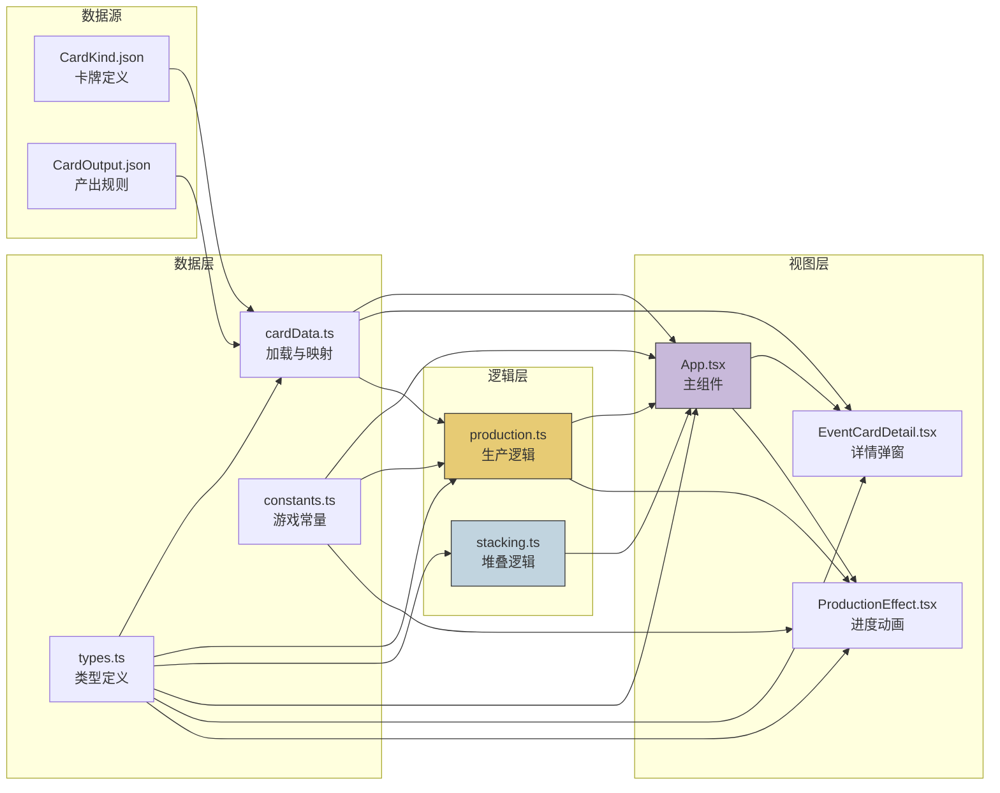

# SOSimulator 项目结构与逻辑文档

> 受《密教模拟器》启发的网页卡牌桌面原型

## 1. 项目概述

| 属性 | 说明 |
|------|------|
| 项目名称 | SOSimulator |
| 技术栈 | React 19 + TypeScript + Vite |
| 游戏类型 | 卡牌拖拽桌面模拟 |
| 核心玩法 | 拖拽卡牌叠放 → 触发配方 → 倒计时产出 |

---

## 2. 目录结构

```
SOS/
├── public/
│   └── favicon.svg              # 网站图标
├── src/
│   ├── components/
│   │   ├── EventCardDetail.tsx  # 事件卡详情弹窗
│   │   └── ProductionEffect.tsx # 生产进度环动画
│   ├── data/
│   │   ├── CardKind.json        # 卡牌定义数据
│   │   └── CardOutput.json      # 卡牌产出规则
│   ├── game/
│   │   ├── types.ts             # 核心类型定义
│   │   ├── constants.ts         # 游戏常量
│   │   ├── cardData.ts          # 卡牌数据加载与初始化
│   │   ├── production.ts        # 生产/配方匹配逻辑
│   │   └── stacking.ts          # 卡牌堆叠与拖拽逻辑
│   ├── App.tsx                  # 主组件
│   ├── App.css                  # 主样式
│   ├── main.tsx                 # 入口文件
│   └── index.css                # 全局样式
├── doc/
│   ├── GDD.md                   # 游戏设计文档
│   ├── CardSystem.md            # 卡牌系统设计
│   └── ...                      # 其他设计文档
└── package.json
```

---

## 3. 架构图

### 3.1 项目模块依赖图



### 3.2 核心游戏循环状态机



### 3.3 卡牌堆叠关系模型



### 3.4 配方匹配与生产流程



### 3.5 数据流图



---

## 4. 核心类型体系

### 3.1 卡牌相关

```typescript
// 桌面上的卡牌实例
type TableCard = {
  id: string                    // 实例唯一ID
  definitionId: string           // 对应定义ID
  name: string                   // 显示名称
  kind: string                   // 类型: resource/clue/routine/event
  kindLabel: string              // 类型显示标签
  note: string                   // 描述文本
  accent: string                 // 视觉主题色
  x: number                      // 桌面X坐标
  y: number                      // 桌面Y坐标
  parentCardId: string | null    // 父卡牌ID（叠放关系）
  childCardId: string | null     // 子卡牌ID（叠放关系）
  spawnedAtMs?: number           // 生成时间戳（用于动画）
  spawnOriginX?: number          // 动画起点X
  spawnOriginY?: number          // 动画起点Y
}

// 卡牌定义（来自JSON配置）
type CardDefinitionRecord = {
  id: string
  name: string
  kind: string
  kindLabel: string
  note: string
  accent: string
  details?: string               // 事件卡额外详情
}
```

### 3.2 生产/配方相关

```typescript
// 产出规则（来自JSON配置）
type CardOutputRule = {
  id: string
  parentDefinitionId: string     // 父卡牌定义ID
  childDefinitionId: string      // 子卡牌定义ID
  durationMs: number             // 生产持续时间
  event: string                  // 事件名称
  outputDefinitionId?: string | null  // 产出卡牌定义ID
  consumeChild: boolean          // 是否消耗子卡牌
}

// 生产运行状态
type ProductionRun = {
  id: string
  ruleId: string
  pairKey: string                // 唯一配对键 ruleId:parentId:childId
  parentCardId: string
  childCardId: string
  outputDefinitionId?: string | null
  event: string
  durationMs: number
  consumeChild: boolean
  startedAtMs: number
  status: 'active' | 'shrinking'
  nextQueued?: boolean           // 是否已预排队下一个周期
  shrinkStartedAtMs?: number     // 收缩动画开始时间
  cancelProgress?: number        // 取消时的进度快照
}

// 配方匹配结果
type ProductionMatch = {
  pairKey: string
  parentCard: TableCard
  childCard: TableCard
  rule: CardOutputRule
}
```

### 3.3 拖拽相关

```typescript
type DragState = {
  cardId: string
  pointerId: number
  offsetX: number                // 鼠标相对卡牌的偏移
  offsetY: number
  startClientX: number           // 拖拽起始位置（用于区分点击）
  startClientY: number
}
```

---

## 4. 核心逻辑实现

### 4.1 卡牌堆叠系统 (stacking.ts)

#### 堆叠关系模型
- 每张卡牌最多有一个 `parentCardId` 和一个 `childCardId`
- 形成**链式结构**（非树状），即 A → B → C
- 拖拽父卡牌时，所有后代卡牌跟随移动

#### 关键函数

| 函数 | 职责 |
|------|------|
| `bringCardToFront` | 将卡牌移到数组末尾（提升z-index） |
| `detachCardFromParent` | 解除卡牌与父卡牌的堆叠关系 |
| `getSnappedCardPosition` | 计算拖拽释放时的吸附位置 |
| `updateStackRelationship` | 更新卡牌间的父子关系 |
| `getDescendantIds` | 获取卡牌的所有后代ID |
| `getCardZIndex` | 计算卡牌层级（拖拽中1000+，普通按根卡牌索引） |
| `getRootCardId` | 获取堆叠链的根卡牌 |
| `getStackDepth` | 获取卡牌在堆叠链中的深度 |
| `clampCardPosition` | 将卡牌位置限制在桌面边界内 |

#### 吸附规则
```
吸附触发条件：
- Y方向：拖拽卡牌顶部对齐目标卡牌的标题线（CARD_TITLE_LINE_OFFSET = 31px）
- X方向：左右边缘对齐目标卡牌
- 阈值：CARD_SNAP_THRESHOLD = 18px（新吸附）/ CARD_SNAP_EDGE_THRESHOLD = 15px
- 已吸附的卡牌脱离阈值更大（+10px额外容差）
```

### 4.2 生产系统 (production.ts)

#### 配方匹配流程
```
1. 遍历所有有 childCardId 的父卡牌
2. 查找匹配的 CardOutputRule（parentDefinitionId + childDefinitionId）
3. 生成 ProductionMatch（包含唯一 pairKey）
```

#### 生产生命周期
```
active（进行中）
  ↓ durationMs 时间到达
finished → 消耗子卡牌（若 consumeChild=true）→ 生成产出卡牌
  ↓ 若匹配仍然存在且 nextQueued
重新进入 active（循环生产）

shrinking（配方解除）
  ↓ PRODUCTION_RING_SHRINK_MS 收缩动画结束
移除 ProductionRun
```

#### 关键函数

| 函数 | 职责 |
|------|------|
| `getProductionMatches` | 扫描桌面，找出所有匹配的配方对 |
| `getProductionAnchor` | 获取生产动画的中心点（父卡牌中心） |
| `spawnOutputCard` | 在父卡牌周围生成产出卡牌（黄金角度分布） |
| `consumeChildCard` | 消耗子卡牌及其后代，解除堆叠关系 |

#### 产出卡牌生成算法
```typescript
// 使用黄金角度（137.5°）分散生成位置，避免重叠
const angleSeed = instanceSequenceRef.current * 1.61803398875
const angle = (angleSeed % 1) * Math.PI * 2
const distance = CARD_SPAWN_DISTANCE_MIN + (随机偏移)
// 限制在桌面边界内
```

### 4.3 主组件状态管理 (App.tsx)

#### 状态列表

| 状态 | 类型 | 说明 |
|------|------|------|
| `cards` | `TableCard[]` | 桌面上的所有卡牌 |
| `draggingId` | `string \| null` | 当前拖拽中的卡牌ID |
| `productions` | `ProductionRun[]` | 活跃的生产进程 |
| `nowMs` | `number` | 当前时间戳（驱动动画） |
| `selectedEventDefinitionId` | `string \| null` | 选中查看详情的事件卡 |

#### 核心Effect

**Effect 1: 时间驱动器**
```typescript
// 当有生产进程时，每16ms更新 nowMs
// 驱动 ProductionEffect 的进度环动画
```

**Effect 2: 配方检测**
```typescript
// 当 cards 变化时：
// 1. 获取当前所有配方匹配
// 2. 已有但未匹配的 run → 进入 shrinking 状态
// 3. 匹配但未启动的 → 创建新的 ProductionRun
```

**Effect 3: 生产完成处理**
```typescript
// 当 nowMs 或 productions 变化时：
// 1. 找出已完成的 run（elapsed >= durationMs）
// 2. 找出需要预排队的 run（接近完成且匹配仍在）
// 3. 找出收缩动画结束的 run
// 4. 批量更新：移除完成项、预排队新周期、消耗/产出卡牌
```

#### 拖拽事件处理

| 事件 | 处理逻辑 |
|------|----------|
| `onPointerDown` | 记录拖拽状态、解除堆叠、提升到最前 |
| `onPointerMove` | 更新位置、检测吸附、移动后代卡牌 |
| `onPointerUp` | 释放拖拽、保留最终堆叠关系 |
| `onClick` | 若未拖拽（移动<4px），打开事件卡详情 |

### 4.4 视觉组件

#### ProductionEffect.tsx
- 在父卡牌中心显示进度环
- 包含：外环（缩放动画）+ SVG进度圆（stroke-dashoffset）
- 状态：
  - `active`: 环逐渐放大，进度条前进
  - `shrinking`: 环缩小并淡出
  - `nextQueued`: 进度条保持满格

#### EventCardDetail.tsx
- 模态弹窗显示事件卡详情
- 列出所有可触发的配方结果（从 CardOutput.json 筛选）
- 显示消耗/保留行为和产出卡牌

---

## 5. 数据配置

### 5.1 卡牌定义 (CardKind.json)

当前6张卡牌：

| ID | 名称 | 类型 | 主题色 |
|----|------|------|--------|
| energy | 精力 | resource | resource |
| time | 时间 | resource | time |
| poor-clue | 贫瘠线索 | clue | clue |
| daily-work | 日常工作 | routine | routine |
| event-card | 事件 | event | event |
| money | 金钱 | resource | money |

### 5.2 产出规则 (CardOutput.json)

当前4条规则：

| 规则ID | 父卡牌 | 子卡牌 | 时长 | 产出 | 消耗子卡 |
|--------|--------|--------|------|------|----------|
| daily-work-energy-money | 日常工作 | 精力 | 5s | 金钱 | 是 |
| event-energy-money | 事件 | 精力 | 4s | 金钱 | 是 |
| event-time-energy | 事件 | 时间 | 4s | 精力 | 是 |
| event-money-empty | 事件 | 金钱 | 4s | 无 | 是 |

---

## 6. 游戏常量

| 常量 | 值 | 说明 |
|------|-----|------|
| CARD_WIDTH | 118 | 卡牌宽度(px) |
| CARD_HEIGHT | 157 | 卡牌高度(px) |
| CARD_SNAP_THRESHOLD | 18 | 吸附阈值(px) |
| CARD_SNAP_EDGE_THRESHOLD | 15 | 边缘吸附阈值(px) |
| PRODUCTION_RING_DIAMETER | 250 | 进度环直径(px) |
| PRODUCTION_RING_GROW_MS | 300 | 环放大动画时长(ms) |
| PRODUCTION_RING_SHRINK_MS | 220 | 环收缩动画时长(ms) |
| CARD_SPAWN_ANIMATION_MS | 520 | 卡牌生成动画时长(ms) |
| CARD_SPAWN_DISTANCE_MIN | 90 | 产出卡牌最小距离(px) |
| CARD_SPAWN_DISTANCE_MAX | 128 | 产出卡牌最大距离(px) |

---

## 7. 视觉设计

### 7.1 色彩主题
- 背景：暖棕色渐变（#c6af97 → #8e735c）
- 卡牌：米白色底 + 类型色渐变
- 类型色：
  - resource: 暖黄 #f2e1b8
  - time: 淡蓝 #c1d4df
  - clue: 灰绿 #d8dfcf
  - routine: 米灰 #ddd0c4
  - money: 金色 #e7cb74
  - event: 淡紫 #c8b9da

### 7.2 动画
- 卡牌生成：从中心缩放+旋转进入（520ms cubic-bezier）
- 拖拽：阴影加深、cursor变为grabbing
- 进度环：SVG stroke-dashoffset 驱动

---

## 8. 扩展方向

根据设计文档，后续可扩展：

1. **更多卡牌类型**: knowledge, state, tool, ritual, ending
2. **复杂配方**: 多槽位、条件产出、随机产出
3. **卡牌寿命**: 倒计时腐化机制
4. **日志系统**: 行动反馈文本
5. **胜利/失败结局**: 完整游戏循环
6. **卡牌详情面板**: 右键查看所有卡牌

---

*文档生成时间: 2026-05-02*
